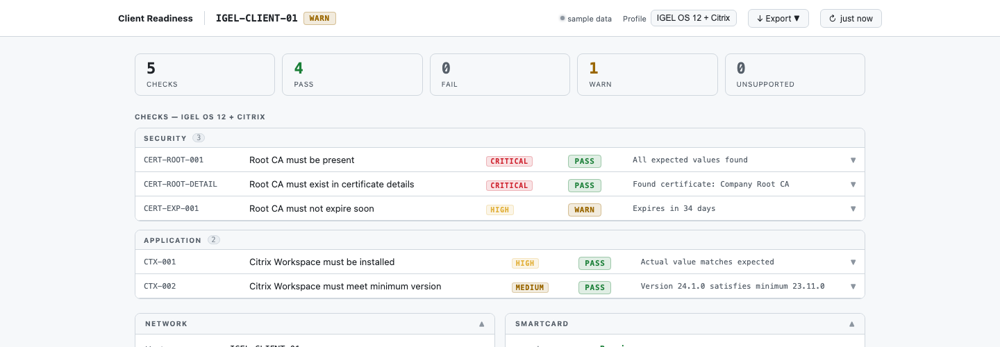
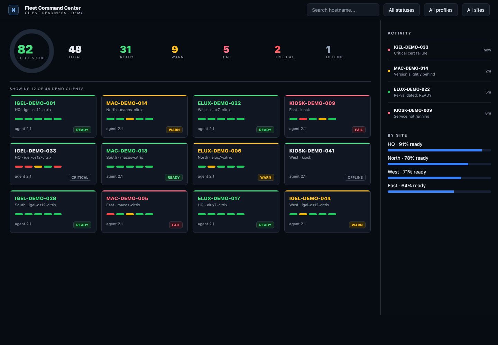
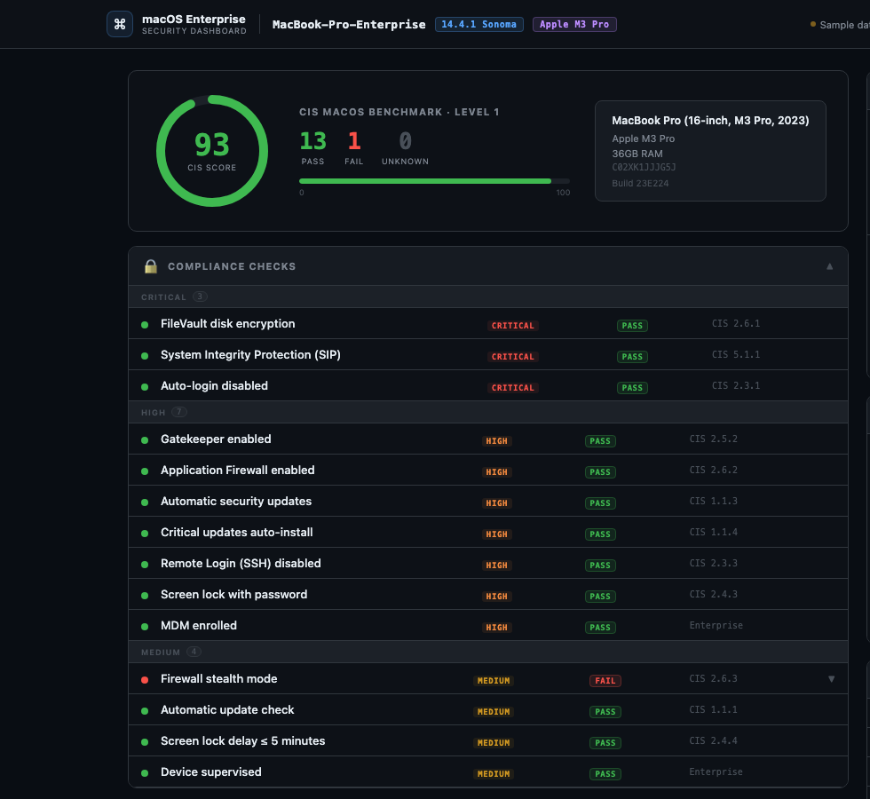
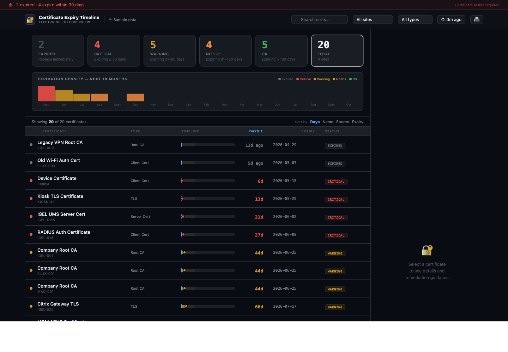
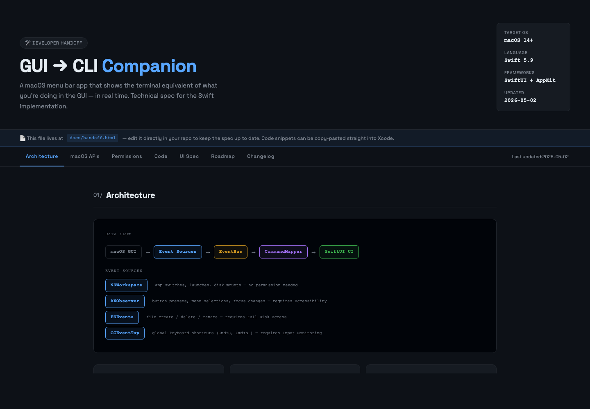
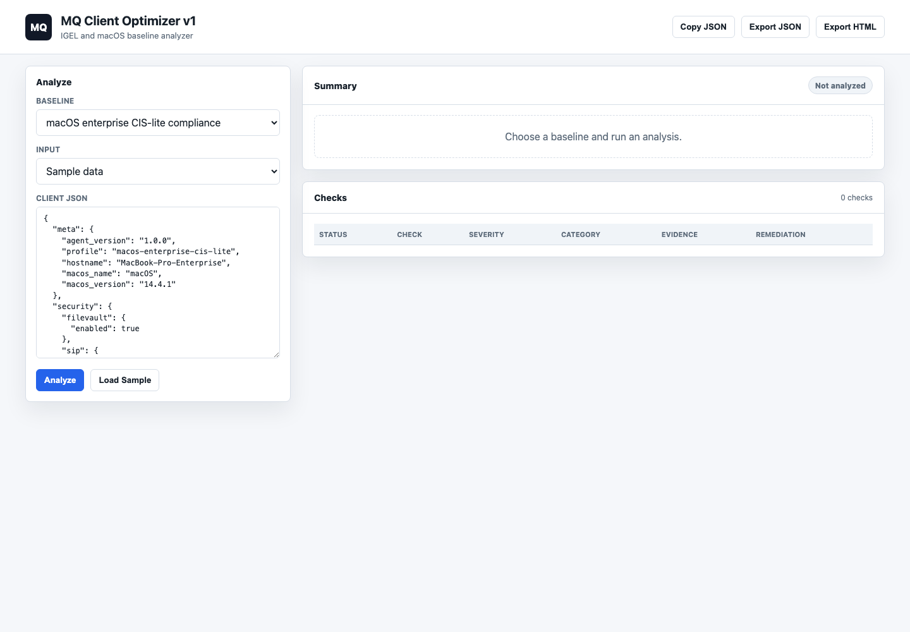

# Design-Prototype Demo Gallery

Design-Prototype contains browser-based prototypes and local helper tools for enterprise client validation, fleet visibility, macOS compliance, and operator workflow handoff.

## Main demos

| Prototype | What it shows | Screenshot | Status |
|---|---|---|---|
| Client Readiness Dashboard | Endpoint readiness and enterprise workflow checks | `docs/screenshots/client-readiness-dashboard.png` | Screenshot available |
| Fleet Command Center | Fleet-level endpoint visibility | `docs/screenshots/fleet-command-center.png` | Screenshot available |
| macOS Enterprise Dashboard | macOS compliance, MDM, users, updates, and certificates | `docs/screenshots/macos-enterprise-dashboard.png` | Screenshot available |
| Certificate Expiry Timeline | Certificate expiry risk over time | `docs/screenshots/certificate-expiry-timeline.png` | Screenshot available |
| MQ Mirror | macOS GUI action to CLI command translation | `docs/screenshots/mq-mirror.png` | Screenshot available |
| MQ Client Optimizer | Baseline evaluation and client readiness scoring | `docs/screenshots/mq-client-optimizer.png` | Screenshot available |


## Screenshots

### Client Readiness Dashboard



### Fleet Command Center



### macOS Enterprise Dashboard



### Certificate Expiry Timeline



### MQ Mirror



### MQ Client Optimizer



## Screenshot checklist

Each screenshot should show:

- the main UI
- example data
- visible title/header
- no private hostnames
- no serial numbers
- no real usernames
- no internal IP addresses
- no certificates or sensitive identifiers

## Recommended screenshot names

```text
docs/screenshots/client-readiness-dashboard.png
docs/screenshots/fleet-command-center.png
docs/screenshots/macos-enterprise-dashboard.png
docs/screenshots/certificate-expiry-timeline.png
docs/screenshots/mq-mirror.png
docs/screenshots/mq-client-optimizer.png
```

## Publish target

The repo should be understandable in this order:

1. README
2. Demo Gallery
3. Project Map
4. Project Status
5. Individual prototype docs
